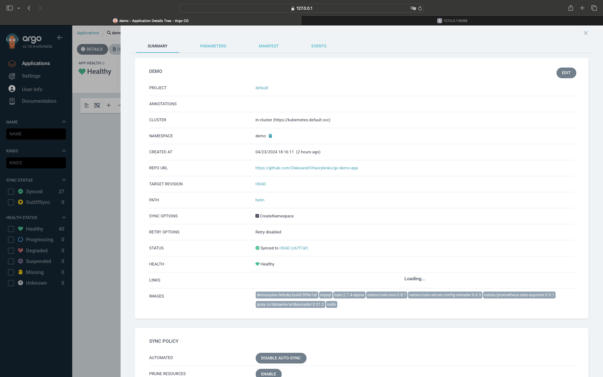
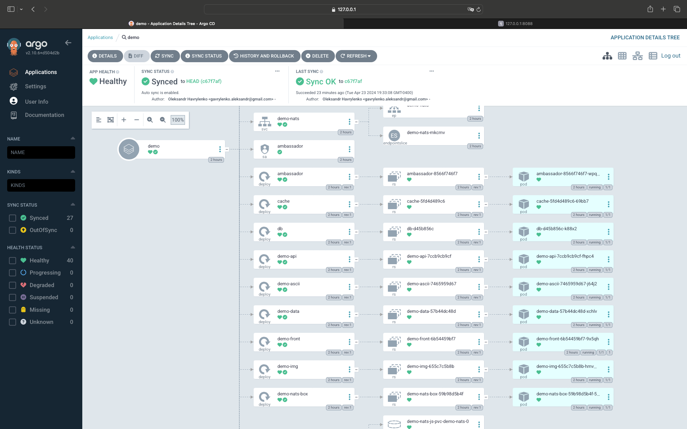
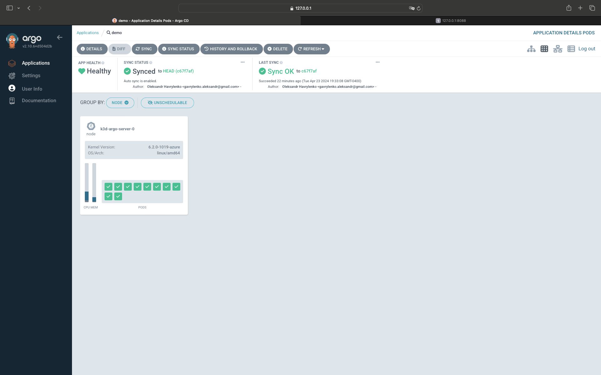

# AsciiArtify Demo
### Open ArgoCD on localhost:8080  
#### Create new application in ArgoCD with next parameters and sync policy automated

#### Press sync button and wait untill syncing and deployed all components 

#### After syncing you should see all pods to be green  

#### Then open console and try AsciiArtify application  

// Check that all services are running  
kubectl get svc -n demo  

// Forward port of ambassador service to 8088 port  
kubectl port-forward -n demo svc/ambassador 8088:80&  

// Check that AsciiArtify is working on port 8088  
curl localhost:8088  

// Download any image
wget -O /tmp/g.png https://www.google.com/images/branding/googlelogo/1x/googlelogo_color_272x92dp.png  

// Upload image to AsciiArtify endpoint on localhost:8088/img/ 
curl -F 'image=@/tmp/g.png' localhost:8088/img/  

